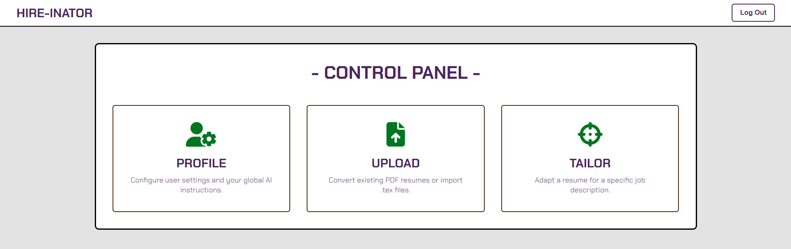

# Hire-inator inator
##### Behold! My latest, most brilliant invention... the Hire-inator! With this device, I will finally be able to take over the entire TRI-STATE AREA... of job applications! No longer will I be thwarted by tedious resume tailoring. With the press of a button, it customizes, humanizes, and perfects any resume for any job description. Soon, every hiring manager will be under my control! Mwahahaha!

---
## 📜 The Evil Scheme (About The Project)
Tired of manually editing your resume for every single job application? The Hire-inator is a full-stack web application that uses the power of AI (my brilliant evil science) to automate this tedious process. You simply provide a base resume, a job description, and your custom instructions, and the Hire-inator generates a perfectly tailored, human-sounding LaTeX resume, ready to be compiled into a PDF and sent off to conquer the corporate world.
### ✨ Core Features-inators
* 🤖 AI-Powered Tailoring: Uses the Google Gemini API to intelligently rewrite and adapt your resume content to match the keywords and requirements of any job description.
* ✍️ Content Humanization: A secondary AI process polishes the generated text to sound more natural and less like a robot (Perry the Platypus will never know!).
* 📄 PDF & LaTeX Management: Upload existing PDF or .tex resumes, and download your final creation as a beautifully compiled PDF or the source .tex file.
* 💬 Interactive Chat Editor: Once a resume is tailored, you can enter an editor and use a chat interface to give the AI further instructions for iterative refinement.
* 🔐 Secure User Management: All user accounts and data are handled securely using Firebase Authentication and Firestore, so your evil plans... I mean, resumes... are safe.
---
## 🛠️ Tech Stack-inator
* Frontend: React (Vite), CSS
* Backend: Python with Django
* Database & Auth: Google Firebase (Firestore & Firebase Authentication)
* AI & Machine Learning: Google Gemini API
* LaTeX Compilation: MiKTeX / TeX Live (via pdflatex)
---
## 🚀 Getting Started: Building Your Own Hire-inator!
To get your own evil laboratory... err, development environment... up and running, follow these steps.
### Prerequisites
* Git
* Python 3.10+ and Pip
* Node.js and npm
* A local installation of a LaTeX distribution (like MiKTeX for Windows or TeX Live for Mac/Linux).
### 1. Firebase Project Setup (The Power Source!)
Before you can run the code, you need to create your own Firebase project to provide the power.
1. Create a Firebase Project:
* Go to the Firebase Console.
* Click "Add project" and give it a name (e.g., "my-hire-inator").
2. Enable Authentication:
* In your new project, go to Build > Authentication.
* Click "Get started".
* Under the "Sign-in method" tab, enable Email/Password and Google.
3. Enable Firestore Database:
* Go to Build > Firestore Database.
* Click "Create database".
* Start in Test mode for easy development.
* Choose a location and click "Enable".
4. Get Backend Credentials (serviceAccountKey.json):
* Click the gear icon ⚙️ next to "Project Overview" and go to Project settings.
* Go to the Service accounts tab.
* Click "Generate new private key". A JSON file will be downloaded.
* IMPORTANT: Rename this file to serviceAccountKey.json. This is your secret key!
5. Get Frontend Configuration (firebaseConfig):
* In Project settings, go to the General tab.
* Scroll down to "Your apps" and click the web icon (</>). If you don't have a web app, create one.
* Give your app a nickname (e.g., "Frontend") and click "Register app".
* You will be shown a firebaseConfig object. Copy this entire JavaScript object. We will need it soon.
### 2. Installation & Local Setup
Now, let's set up the code.
1. Clone the Repository:
```sh
# git clone https://github.com/Ronin-117/Hire-inator.git
# cd Hire-inator
```
2. Setup the Python Backend:
* Create and activate a Python virtual environment:
```sh
# python -m venv venv
# # On Windows:
# .\venv\Scripts\activate
# # On Mac/Linux:
# source venv/bin/activate
```
* Install the required Python packages:
```sh
# pip install -r requirements.txt
```
* Navigate into the backend folder:
```sh
# cd backend
```
* Place your secret serviceAccountKey.json file inside this backend folder.
* Create a file named .env inside the backend folder and add your Gemini API key:
```.env
# GEMINI_API_KEY="YOUR_GEMINI_API_KEY_HERE"
```
* Start the Django server:
```sh
# python manage.py runserver
```
* Your backend is now running at http://127.0.0.1:8000.
3. Setup the React Frontend:
* Open a new terminal.
* Navigate into the frontend folder from the project root:
```sh
# cd frontend
```
* Install the required npm packages:
```sh
# npm install
```
* Create a file named firebaseConfig.js inside the frontend/src folder.
* Paste the following code into frontend/src/firebaseConfig.js, replacing the placeholder with the firebaseConfig object you copied from the Firebase console:
```javascript
 // src/firebaseConfig.js
 import { initializeApp } from "firebase/app";
 import { getAuth, GoogleAuthProvider } from "firebase/auth";
 import { getFirestore } from "firebase/firestore";
 const firebaseConfig = {
 // PASTE YOUR COPIED CONFIG OBJECT HERE
 apiKey: "...",
 authDomain: "...",
 projectId: "...",
 storageBucket: "...",
 messagingSenderId: "...",
 appId: "..."
 };
 const app = initializeApp(firebaseConfig);
 export const auth = getAuth(app);
 export const googleProvider = new GoogleAuthProvider();
 export const db = getFirestore(app);
```
* Start the React development server:
```sh
# npm run dev
```
* Your frontend is now running! Open your browser and go to http://localhost:5173.
---
## 💥 Behold!
If you've followed all the steps, you should now have a fully functional Hire-inator, ready to take over the world... one job application at a time! Now, if you'll excuse me, I have a certain platypus to deal with.

## 🤝 Contributing-inator (A Call for Evil Geniuses!)

My evil plans are nearly complete, but even a genius like myself requires minions... err, *collaborators*! The Hire-inator is a work in progress, and my schemes are sometimes thwarted by pesky bugs.

Currently, I'm seeking evil geniuses to help improve two key areas:

*   **The AI Tailoring Logic:** The Gemini prompts for tailoring can sometimes be inconsistent. Improving these instructions to get more reliable and accurate results is a top priority.
*   **The LaTeX-to-PDF Compilation-inator:** The final PDF generation is fragile. AI-generated `.tex` files can contain tricky syntax that causes compilation to fail. Making this process more robust with better error handling and text sanitization would be a huge victory.

If you have a brilliant, evil idea to fix these issues or add a new feature, your contributions are welcome! Please feel free to **fork the repository** and submit your new schematics as a **Pull Request**.